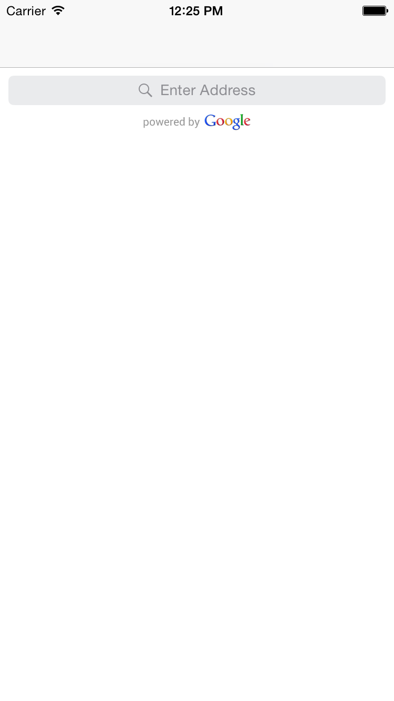
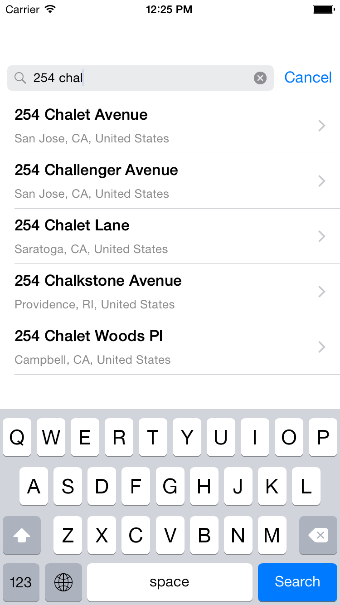

# GooglePlacesSearchController

[](http://cocoapods.org/pods/GooglePlacesSearchController)
[](http://cocoapods.org/pods/GooglePlacesSearchController)
[](http://cocoapods.org/pods/GooglePlacesSearchController)


A simple [Google Places API](https://developers.google.com/places/documentation/autocomplete) autocompleting address search controller (subclass of ```UISearchController```) for iOS devices.

GooglePlacesSearchController is 100% Swift 4, and is a fork of https://github.com/watsonbox/ios_google_places_autocomplete.

No attempt has been made to integrate MapKit since displaying Google Places on a non-Google map is against their terms of service.

___

## Screenshots
<table width="100%">
  <tr>
    <td align="left"></td>
    <td align="right"></td>
  </td>
</table>

----------

## Usage

To run the example project, clone the repo, and run `pod install` from the Example directory first.

## Requirements

iOS 8.0+
Xcode 8.0+ / Swift 4.0

## Installation

GooglePlacesSearchController is available through [CocoaPods](http://cocoapods.org). To install
it, simply add the following line to your Podfile:

```ruby
pod "GooglePlacesSearchController"
```


##Usage
```swift
var controller: GooglePlacesSearchController!
controller = GooglePlacesAutocomplete(
    apiKey: "YOUR_GOOGLE_MAPS_SERVER_KEY",
    placeType: PlaceType.Address
)
```
        
Or with specified region

```swift
var controller: GooglePlacesSearchController!

let coord = CLLocationCoordinate2D(latitude: 55.751244, longitude: 37.618423)
controller = GooglePlacesAutocomplete(
    apiKey: "YOUR_GOOGLE_MAPS_SERVER_KEY",
    placeType: PlaceType.Address,
    coordinate: coord,
    radius: 10
)
```

And then add controller's searchbar ```controller.searchBar``` to your view.

To get selected place use closure
```swift
controller.didSelectGooglePlace { (place) -> Void in
    println(place.description)
} 
```

## Author and Collaborators

Dmitry Shmidt
Evgeny Aleksandrov
Aurelien
Furqan Muhammad Khan
caotrido

## License

GooglePlacesSearchController is available under the MIT license. See the LICENSE file for more info.
